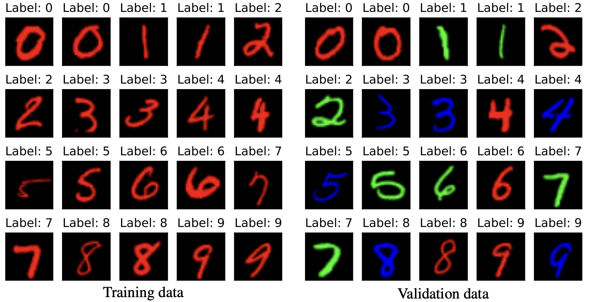

# Generalized Importance Weighting (GIW)
Code for the paper "Generalizing Importance Weighting to A Universal Solver for Distribution Shift Problems". This paper was selected for spotlight presentation at NeurIPS 2023.

## Requirements
The code was developed and tested based on the following environment:
- python 3.10.9
- pytorch 1.13.1
- torchvision 0.14.1
- cudatoolkit 11.6.1
- cvxopt 1.3.0
- scikit-learn 1.2.1
- matplotlib 
- tqdm

To install the above dependencies (reference only):
```
conda install pytorch==1.13.1 torchvision==0.14.1 pytorch-cuda=11.6 -c pytorch -c nvidia
pip install cvxopt==1.3.0 scikit-learn==1.2.1 matplotlib tqdm
```

## Quick start
The code shows a demo of 10-digit classification on Color-MNIST dataset, which is derived from MNIST where the digits in training data are colored in red while digits in test/validation data are colored in red/blue/green evenly. A plot of the training and validation data in Color-MNIST dataset is shown below.



After installing the dependencies, you can simply run the demo by `python giw.py`.

## Demo results
